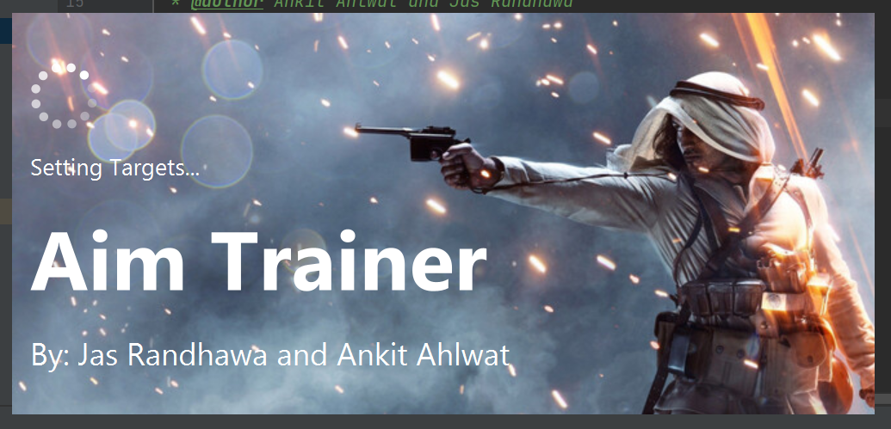
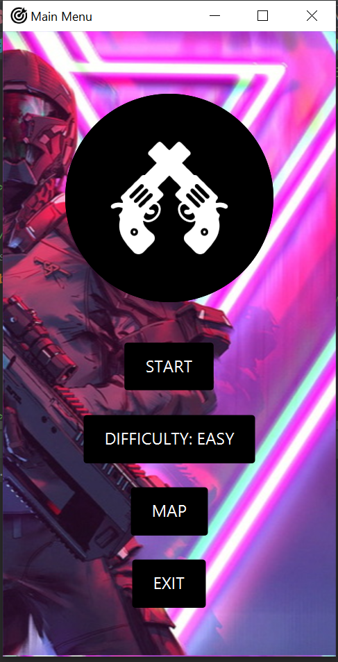
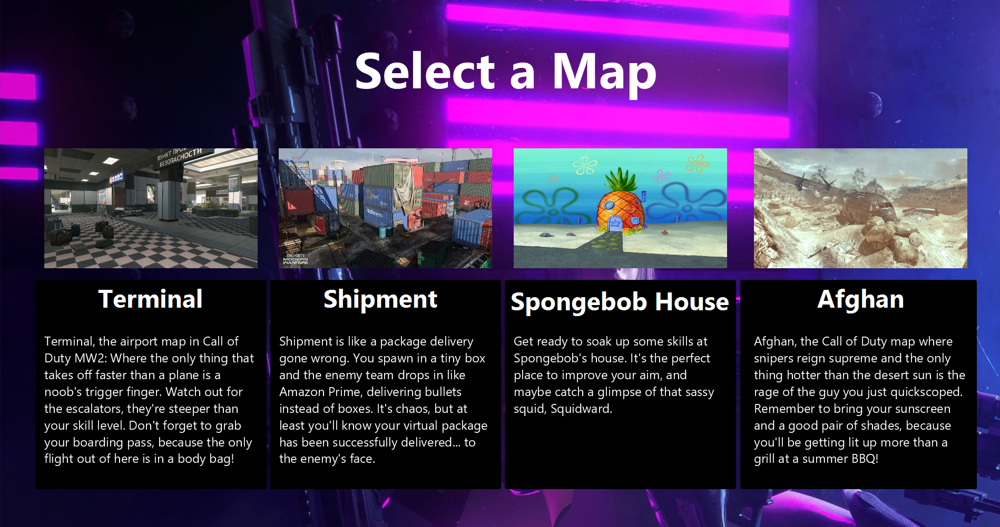
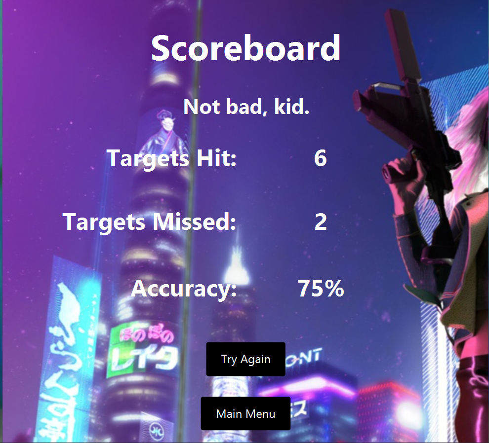

# Aim Trainer Game

This is an Aim Trainer Game designed to help improve your aim and accuracy in first-person shooter games.

## How to Play

To play the Aim Trainer Game:

1. Open the `GameApplication.java` file.
2. Click the "Run" button to compile and run the game.
3. Choose a game mode and level of difficulty from the main menu.
4. Use your mouse to aim and click to shoot the targets.
5. Your accuracy will be displayed on the screen after each round.
6. Keep practicing to improve your scores and aim.

Make sure you have all the necessary files and libraries installed before running the game.

## Difficulty Levels

There are three levels of difficulty available:

- Easy: This level is suitable for beginners.
- Medium: This level is suitable for intermediate players.
- Hard: This level is suitable for advanced players.

## Features

- Easy to use interface with simple controls.
- Realistic graphics and sound effects.
- Leaderboard to track your progress and compare your scores with others.
- Customizable settings to adjust the game's difficulty and speed.

### Preloader

You will be welcomed with a nice preloader before the game begins.

### Main Menu

This is the main menu where you can select maps, difficulty and start the game. It also includes a soundtrack.

### Map Selection

Custom Map selection!

### Gameplay

This is a screenshot of the gameplay, where you can use your mouse to aim and shoot the targets.

### Scoreboard

This is the final scoreboard that keeps track of your accuracy.

